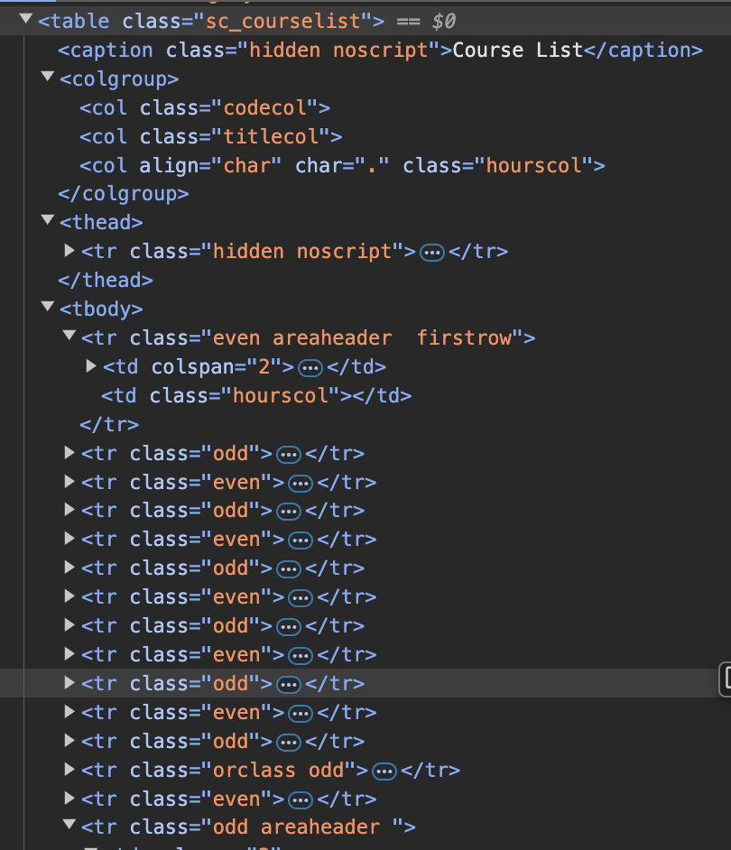
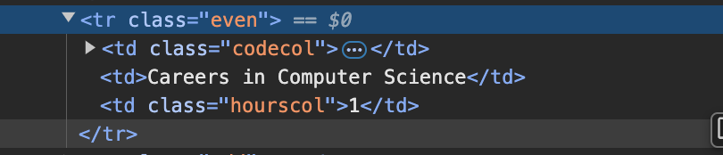

# Welcome to the data schema.

### Outline for the table data listed on the "Course requirements" for my computer science degree at the University of Montana.

##### This is the main table.

You can see that there are three main columns of data listed as `<colgroup>`.
Each colgoup tag has classes that identify the type of data that each column
holds

1. "codecol": School: string Course: num

2. "titlecol": Course Title: string

3. "hourscol": Credit Hours / Class: num

### Subtables list

- Core Courses
- Science Core
- Science Electives
- Communications Requirement
- Software Engineering Core
- Advanced Software Electives
- Upper Division CS Electives

Each table has a row below the sub-table-header that describes a condition(s)
for the sub-table to be met/fulfilled.

The website uses `class="courselistcomment"` to describe each comment.

- Core Courses: "Complete all of the following courses"
- Science Core: "Complete 1 of the following subcategories of science sequence",
  "9-10 Credits total"
- Science Electives: "Complete Two of the following courses", "Labratory courses
  must be taken in conjunction with their associated lecture course.", "The
  biology, Chemistry, or Physics sequence chosen to fulfill the science core may
  not count toward the science electives."
- Communications Requirement: "Complete 1 of the following"
- Software Engineering Core: "Complete all of the following"
- Advanced Software Electives: "Complete two of the following"
- Upper Division CS Electives: "Complete 15 credits of the CSCI courses numbered
  300 and above."
